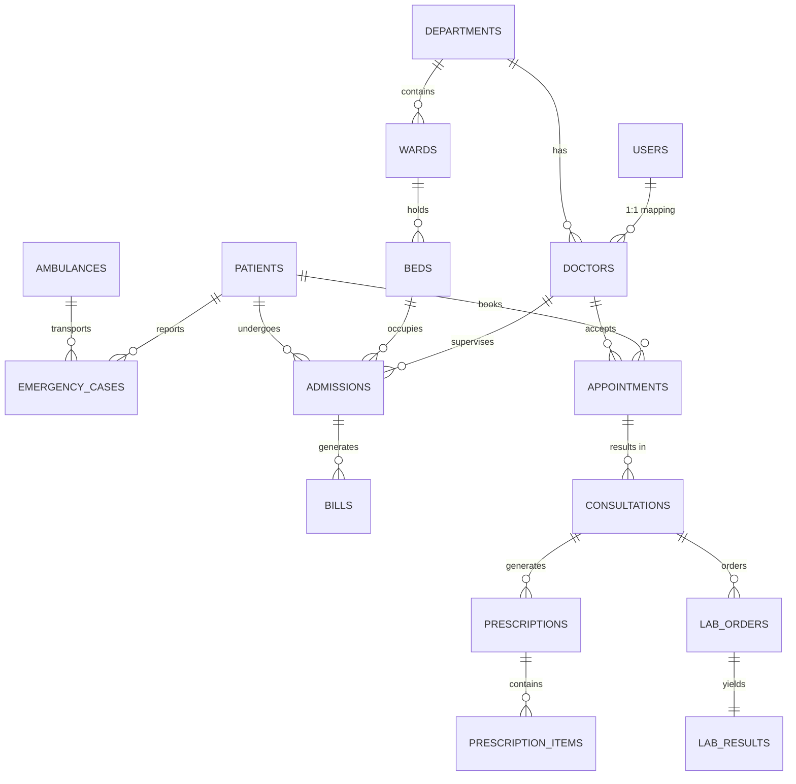

# Real-Time Smart Hospital Management System

A comprehensive, production-ready Real-Time Smart Hospital Management and Emergency Resource Allocation System built with Node.js, Express, React, Vite, Socket.IO, and **MySQL 8.0+**.

## 🚀 Features
- **Real-time Emergency Allocation:** Intelligent emergency queue and resource allocation system running on top of MySQL with row-level locking to handle strict race conditions for highly contested resources (like the last available ICU bed).
- **Live Dashboards:** Socket.IO integration ensures that ambulance arrivals, bed allocations, admissions, and emergency queue changes reflect instantly across all logged-in instances without refreshing.
- **Advanced Concurrency Demo:** A fully reproducible test case demonstrating MySQL transaction integrity and `SELECT ... FOR UPDATE` isolation when multiple incoming emergencies fight for a single ICU bed.
- **Core Modules:**
  - Role-based Authentication (Admin, Doctor, Receptionist, Nurse)
  - Patient & Admissions Management
  - Bed & Ward Tracking (ICU, NICU, General, Isolation)
  - Doctor Scheduling & Workloads
  - Pharmacy & Inventory Automation (with MySQL Triggers)
  - Laboratory Test Processing
  - Automated Billing
  - Ambulance Tracking

## 🛠 Technology Stack
- **Database:** MySQL 8.0+ (Transactions, Triggers, Views, Stored Procedures, Locks)
- **Backend:** Node.js, Express.js, `mysql2/promise`, `socket.io`
- **Frontend:** React, Vite, React Router, Axios, Tailwind-like custom CSS Variables.

## 🗄️ Database Schema & Normalization
The database is fully normalized to **3NF** with over 20 tables:
1. `users`, `departments`, `doctors`, `patients`
2. `wards`, `beds`, `ambulances`, `emergency_cases`
3. `appointments`, `doctor_schedules`, `consultations`, `admissions`
4. `medicines`, `prescriptions`, `prescription_items`
5. `lab_tests`, `lab_orders`, `lab_results`
6. `bills`, `bill_items`, `bed_assignment_log`

### ER Diagram 


### Advanced MySQL Features Demonstrated
- **Transactions & Row-level Locking (`SELECT ... FOR UPDATE SKIP LOCKED`)**: Enforced inside `sp_allocate_emergency` to assign an available bed exactly once.
- **Stored Procedures**: `sp_allocate_emergency`, `sp_admit_patient`, `sp_discharge_patient`, `sp_generate_bill` 
- **Triggers**: Decrease medicine stock on dispensing (`after_prescription_dispense`), prevent negative inventory (`before_medicine_stock_update`), toggle bed occupancy state automatically.
- **Views**: `available_beds_view`, `emergency_queue_view`, `hospital_occupancy_view`, etc.
- **Complex Analytical Queries**: Pre-written inside `database/complex_queries.sql` showcasing CTEs, window functions, and multi-joins.

## 💻 Installation & Setup

We have unified the startup process for convenience. From the root directory:

### 1. Install Dependencies
```bash
npm run install:all
```

### 2. Database Initialization
This will automatically rebuild the entire schema, triggers, seed data, views, and procedures. (Ensure your local MySQL `root` password matches the script or update `package.json` accordingly).
```bash
npm run db:init
```

### 3. Start the Application
This will concurrently start both the Node.js backend (port 5000) and the Vite frontend (port 5173).
```bash
npm run start
```

## 🔒 Demo Credentials
The application is pre-seeded with the following roles. (All passwords are `password123`).
- **Admin**: `admin`
- **Doctor**: `dr.smith`
- **Receptionist**: `reception1`
- **Nurse**: `nurse1`

## 🚦 Concurrency Demo (The "Last ICU Bed" Test)
To prove the MySQL concurrency logic, we have a specialized test script that simultaneously fires two identical `CRITICAL` emergency API requests fighting for a single available ICU bed.

1. Ensure the database is freshly seeded (seed data has exactly ONE `AVAILABLE` ICU bed).
2. Start the backend (`npm start` in `/server`).
3. Run the concurrency test:
```bash
node tests/concurrency_test.js
```
**Expected Output**: The system will allocate the ICU bed to Patient A, and explicitly queue Patient B because the MySQL row lock blocks the parallel transaction and forces it to fetch updated resource states. No JavaScript-level race condition logic is used — the database itself strictly enforces consistency.
